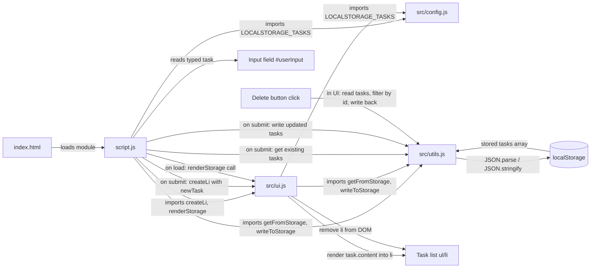

# Component Data Flow

```mermaid
flowchart LR
    HTML[index.html]
    SCRIPT[script.js]
    UI[src/ui.js]
    CONFIG[src/config.js]
    UTILS[src/utils.js]
    LS[(localStorage)]
    INPUT[Input field #userInput]
    LIST[Task list ul/li]
    DELETE[Delete button click]

    HTML -->|loads module| SCRIPT

    SCRIPT -->|imports LOCALSTORAGE_TASKS| CONFIG
    SCRIPT -->|imports createLi, renderStorage| UI
    SCRIPT -->|imports getFromStorage, writeToStorage| UTILS

    UI -->|imports LOCALSTORAGE_TASKS| CONFIG
    UI -->|imports getFromStorage, writeToStorage| UTILS

    SCRIPT -->|reads typed task| INPUT
    SCRIPT -->|on submit: get existing tasks| UTILS
    SCRIPT -->|on submit: write updated tasks| UTILS
    SCRIPT -->|on submit: createLi with newTask| UI
    SCRIPT -->|on load: renderStorage call| UI

    UI -->|render task.content into li| LIST
    DELETE -->|in UI: read tasks, filter by id, write back| UTILS
    UI -->|remove li from DOM| LIST

    UTILS -->|JSON.parse / JSON.stringify| LS
    LS -->|stored tasks array| UTILS
```
