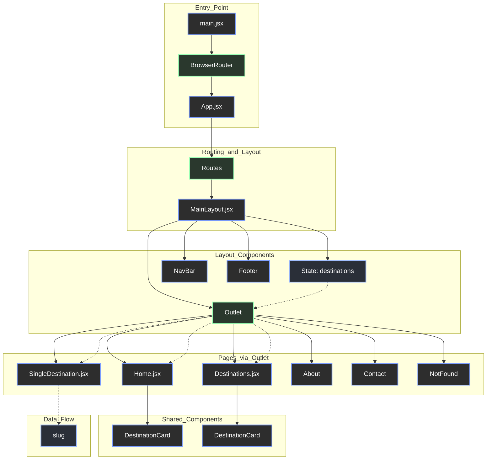

# Component Structure Overview

## Data Flow Description

1. **Data Fetching**: `MainLayout.jsx` fetches the destination data from `/travel.json` inside a `useEffect` hook and stores it in a local state (`destinations`).
2. **Context Passing**: This `destinations` state is passed down to child routes using the `context` prop of the `<Outlet />` component in `MainLayout`.
3. **Data Consumption**:
   - `Home.jsx`, `Destinations.jsx`, and `SingleDestination.jsx` retrieve this data using the `useOutletContext()` hook.
   - `SingleDestination.jsx` additionally uses `useParams()` to extract the `slug` from the URL to find and display the specific destination.
